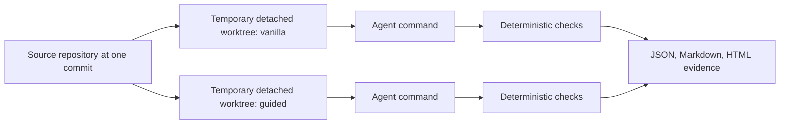

# repo-agent-bench

[](https://github.com/Uky0Yang/repo-agent-bench/actions/workflows/ci.yml)
[](https://www.python.org/)
[](LICENSE)

**A/B test coding-agent workflows on your own repository.**

`repo-agent-bench` runs the same task across different agent configurations in disposable git worktrees, verifies each result with commands you control, and produces reviewable JSON, Markdown, and HTML evidence.

Use it to answer questions such as:

- Does this `AGENTS.md` actually improve success rate?
- Is an Agent Skill better than the vanilla agent on our repository?
- Did adding an MCP server improve outcomes or only add latency and tokens?
- Which coding-agent command produces the smallest verified patch?

```text
Variant       Pass rate   Median time   Median churn   Median tokens
vanilla              0%          0.03s              1              18
guided             100%          0.03s              1              22
```

> The numbers above come from the bundled deterministic demo, not a claim about a real model.

## Why this exists

Coding-agent performance increasingly depends on the harness around the model: repository instructions, skills, tools, context, verification, and recovery loops. Public leaderboards cannot tell you which workflow works on **your** codebase.

This project follows three principles:

- **Outcome first:** deterministic checks decide pass or fail; agent claims do not.
- **Repository local:** no hosted service, database, model call, or telemetry in the harness.
- **Comparable evidence:** every variant gets the same base commit, prompt, timeout, trials, and checks.

The direction is informed by current work on [harness engineering](https://openai.com/index/harness-engineering/), [agent evaluations](https://www.anthropic.com/engineering/demystifying-evals-for-ai-agents), and the growing [Agent Skills standard](https://agentskills.io/).

## Quick start: no API key required

```bash
git clone https://github.com/Uky0Yang/repo-agent-bench.git
cd repo-agent-bench
python -m pip install -e .
repo-agent-bench run examples/demo/benchmark.yml --output .repo-agent-bench/demo
```

Open `.repo-agent-bench/demo/summary.html`. The demo uses a tiny deterministic fake agent so you can inspect the complete isolation, verification, transcript, token-parsing, and reporting loop without spending model credits.

## A real Codex comparison

Create `benchmark.yml` in the repository you want to measure:

```yaml
version: 1
name: agents-md-ab
repository: .
base_ref: HEAD
prompt: Fix the failing parser behavior without changing the public API.
trials: 3
timeout_seconds: 900

checks:
  - [python, -m, pytest, -q]

allowed_paths:
  - src/**
  - tests/**

variants:
  - name: vanilla
    remove:
      - AGENTS.md
      - .agents/skills
    command: [codex, exec, --json, "{prompt}"]

  - name: guided
    command: [codex, exec, --json, "{prompt}"]
```

Validate before starting a potentially paid run:

```bash
repo-agent-bench validate benchmark.yml
repo-agent-bench run benchmark.yml
```

The `rab` command is a shorter alias:

```bash
rab run benchmark.yml --variant guided
```

## What a run records

- Runner exit code and timeout status
- Every verifier command and exit code
- Changed files and additions/deletions
- Changes outside `allowed_paths`
- Runner and verifier stdout/stderr artifacts
- Token usage when the command emits recognizable JSON/JSONL usage fields
- Pass rate and median duration/churn/tokens across repeated trials

Artifacts are written locally and obvious secret-like environment values are redacted on a best-effort basis before transcripts are saved.

## How isolation works



Variant overlays and removals are committed only inside each detached worktree, so the measured diff starts after the variant setup. Worktrees are removed after evidence is captured.

Important: worktree isolation protects the source checkout from ordinary relative-path edits. It is **not** an OS sandbox. Agent commands inherit the current process environment and can access anything the current user can access. Only run trusted benchmark definitions and use a sandboxed runner when evaluating untrusted agents or repositories.

## Configuration

See [docs/CONFIGURATION.md](docs/CONFIGURATION.md) for the complete schema, overlays, placeholders, exit codes, and measurement rules.

## Current boundaries

- Commands are executed directly as argument arrays, never through a shell wrapper.
- The harness does not install, authenticate, or pay for an agent provider.
- Uncommitted source-repository changes are not included because every trial starts from `base_ref`.
- Token extraction is conservative; when no explicit usage object is present, the report says `unknown`.
- v0.1 runs trials sequentially to avoid surprising concurrent cost or rate-limit spikes.

## Development

```bash
python -m pip install -e ".[dev]"
python -m pytest --cov=repo_agent_bench --cov-branch
python -m ruff check .
python -m ruff format --check .
python -m compileall -q repo_agent_bench tests examples
python -m build
```

See [CONTRIBUTING.md](CONTRIBUTING.md), [ROADMAP.md](ROADMAP.md), and [SECURITY.md](SECURITY.md).

## License

MIT
